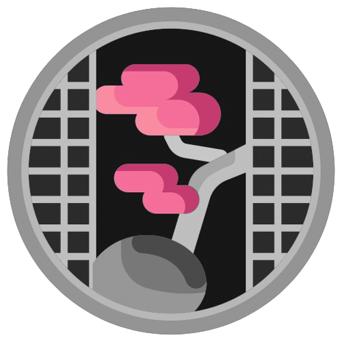

# One-Time Incognito

This extension allows you to switch between a history recording mode and a pseudo-secret mode.

## Usage

You can setup shortcuts in chrome://extensions/shortcuts.

default shortcut:

- Alt + H : Remove all history

### Chenge mode

- When normal-mode, icon of extension is green ( It looks Japanese bonsai, 盆栽 ! ).
- When incognito-mode, it is pink ( It looks Japanese sakura, 桜 XD ).

<table>
    <tr>
        <td>
            
        </td>
        <td>
            
        </td>
    </tr>
</table>

## Credit and Thanks

- icon: created by Umeicon - [Flaticon](https://www.flaticon.com/)

## LICENSE
MIT License (without icons :D)

Copyright (c) 2024 Def4Root